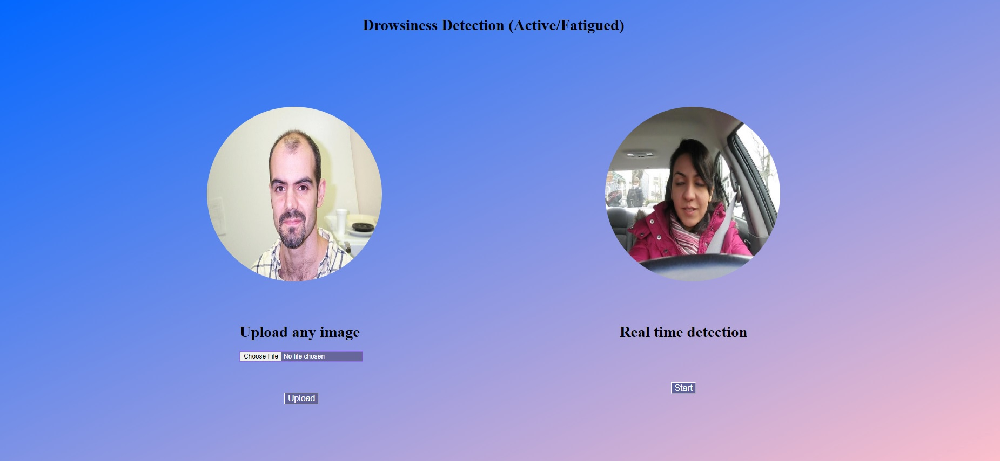
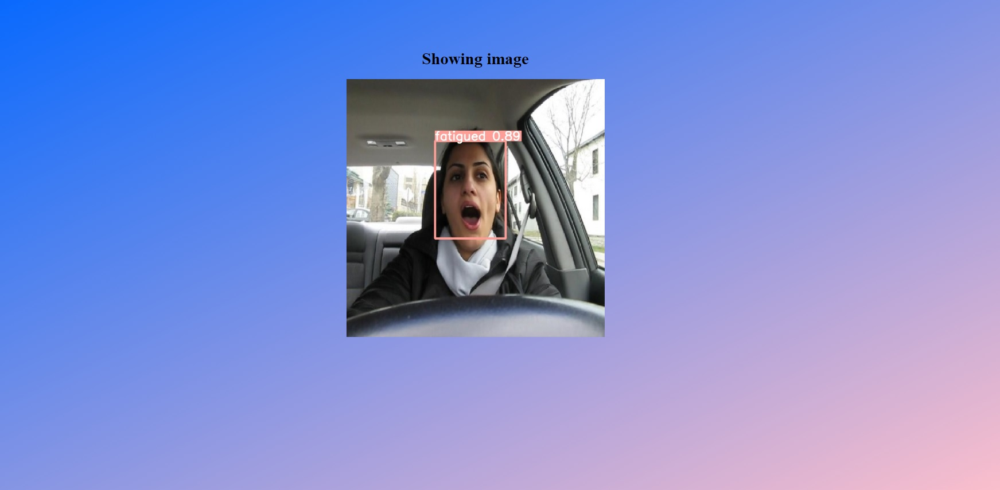

# Drowsiness_Detection_Deployment

## Background
Drowsy driving is a significant public health and safety concern that contributes to many motor vehicle accidents worldwide. According to the National Highway Traffic Safety Administration (NHTSA), approximately 100,000 crashes yearly in the United States can be attributed to drowsy driving, resulting in over 1,550 fatalities and 71,000 injuries. The actual numbers could be much higher, as drowsy driving is often underreported. Factors contributing to drowsy driving include sleep deprivation, the use of sedating medications, alcohol consumption, and working long or irregular hours.

Drowsiness impairs a driver's ability to concentrate, slows their reaction time, and decreases their ability to process information, all of which are critical for safe driving. Detecting driver fatigue before it results in an accident is essential for reducing the number of drowsy driving-related crashes. Facial expression analysis is a potential method for early detection of drowsiness, as specific patterns of facial movements have been associated with fatigue, such as drooping eyelids, yawning, and slow eye closure.

## Objective

The objective of this project is to deploy a self-trained YOLOv8-tiny model on a website, and the team has chosen to utilize Flask for the deployment. However, they have encountered several challenges during the process. Firstly, when attempting to push the deployment to Docker and accessing the camera on a Windows system, they have found that it does not function as expected. Surprisingly, the deployment only seems to work on Linux systems.

Additionally, the team has faced difficulties in figuring out how to access users' cameras effectively. This issue has hindered the successful deployment of the project. As a temporary solution, they have decided to focus solely on detecting drowsiness in pictures, as they were unable to find a viable approach to accessing users' cameras.

The project repository contains three branches, with the "only image" branch representing one of their attempted deployments. Due to the camera access limitations, the team has shifted their focus to detecting drowsiness specifically from static images. However, they have managed to find a solution for accessing users' cameras using JavaScript, which will be included in the repository for future reference and potential integration into the project.

Camera Detection: https://github.com/Jclee967/Yolov8-Object-Detection-on-Browser  

## Run Locally

Clone the project

```bash
  git clone https://github.com/SikYinSun/Drowsiness-Detection-Deployment.git
```

Go to the project directory

```bash
  cd my-project
```

Install python packages
```bash
  pip install -r requirements.txt
```

Start the server
```bash
  python app.py
```
## Screenshot


